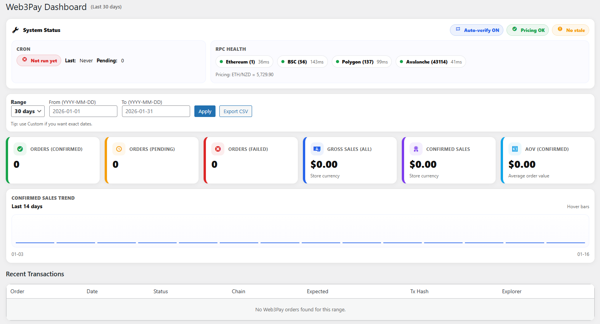
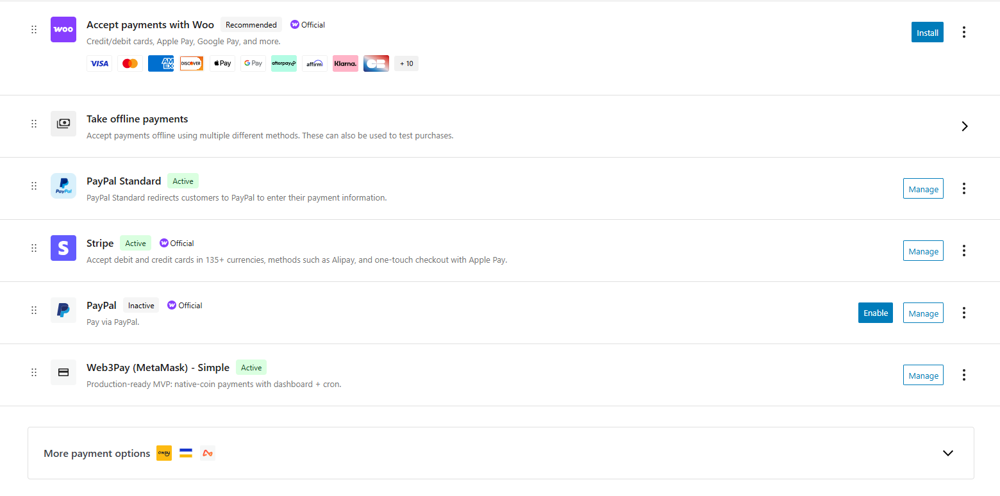
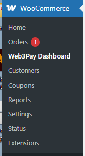

# Web3pay MetaMask WooCommerce

# Web3pay MetaMask WooCommerce

**Web3pay MetaMask WooCommerce** is a professional Web3 payment gateway that allows WooCommerce stores to accept **on-chain cryptocurrency payments directly via MetaMask**, with automated verification, dashboards, and enterprise-grade safety checks.

Designed for merchants who want **reliable crypto payments without complexity**.

---

##  Key Features

### Secure MetaMask Payments
- Native cryptocurrency payments (ETH, BNB, MATIC, AVAX)
- Direct wallet-to-merchant transactions
- No custodians, no intermediaries

### Automatic On-Chain Verification
- Background **WP-Cron auto-verification**
- Confirms payments even if customers close their browser
- Configurable verification intervals

###  Smart Order Management
- Auto-cancel stale pending orders
- Manual “Confirm Now” button for admins
- Global anti-replay protection (prevents tx reuse)

###  Professional Admin Dashboard
- Colorful KPI cards
- Sales overview & recent transactions
- System Status panel (RPC, pricing, cron health)
- Sales trend sparkline (no external libraries)

###  Explorer Integration
- Etherscan, BscScan, Polygonscan, Snowtrace links
- Available on checkout, thank-you page, admin & dashboard

### 🧾 Real-Time Pricing with Fallback
- Live fiat → crypto conversion
- Primary & secondary pricing API fallback
- Cached quotes for performance

###  Payment Safety Features
- Wrong-network detection (blocks payment on incorrect chain)
- Optional fee buffer (%) to protect against volatility
- Underpayment protection

###  Admin Notifications
- Email alerts on confirmed or failed payments
- Configurable recipient email

---

##  Supported Networks
- Ethereum (ETH)
- Binance Smart Chain (BNB)
- Polygon (MATIC)
- Avalanche (AVAX)
- Any EVM-compatible RPC
---
##  Requirements
- WordPress 6.0+
- WooCommerce 7.0+
- PHP 7.4+
- MetaMask browser extension or mobile wallet
---
##  Installation

1. Download the plugin ZIP from **Releases**
2. WordPress Admin → Plugins → Add New → Upload Plugin
3. Upload ZIP and activate
4. Go to **WooCommerce → Settings → Payments → Web3Pay (MetaMask)**
5. Enable the gateway and configure:
   - Merchant wallet addresses
   - Networks JSON
   - Auto-verify & auto-cancel rules
---
##  How Payments Work

1. Customer selects **Crypto (MetaMask)** at checkout
2. Wallet connects & network is validated
3. Real-time crypto quote is generated
4. Customer sends payment on-chain
5. Order is placed as *Pending*
6. Plugin verifies transaction automatically
7. Order is marked *Completed* when confirmed

---

##  Security & Best Practices
- No private keys stored
- No custodial wallets
- No background blockchain listeners
- Uses direct JSON-RPC calls
- Anti-replay transaction protection

---

##  Test Before Going Live
Use testnets (RPC + explorer) to verify:
- Quote accuracy
- Auto-verification
- Email notifications
---
## 📸 Screenshots

### Checkout – MetaMask Payment

*Customers connect MetaMask, receive a real-time crypto quote, and pay directly on-chain.*

---

### Admin Dashboard – Overview

*A professional Web3 dashboard showing KPIs, crypto sales, and recent transactions.*

---

### Web3Pay Gateway Settings

*Configure supported networks, merchant wallet addresses, auto-verification, and safety options.*

---

### WooCommerce Integration

*Web3Pay integrates seamlessly with WooCommerce payment settings.*

---

### WordPress Admin Integration

*Web3Pay dashboard is accessible directly from the WooCommerce admin menu.*

##  Commercial Use
This plugin is intended for **commercial and premium distribution**.

For licensing, support, or custom development:
**Contact the author**
---
## 📄 License

This project is released under a **commercial license**.

© 2026 Pixel Art. All rights reserved.

Unauthorized copying, redistribution, or resale is prohibited.

---

##  Changelog
See **Releases** for full version history.

---

##  Why Web3pay?
Because merchants deserve crypto payments that feel as reliable as Stripe — without giving up decentralization.
